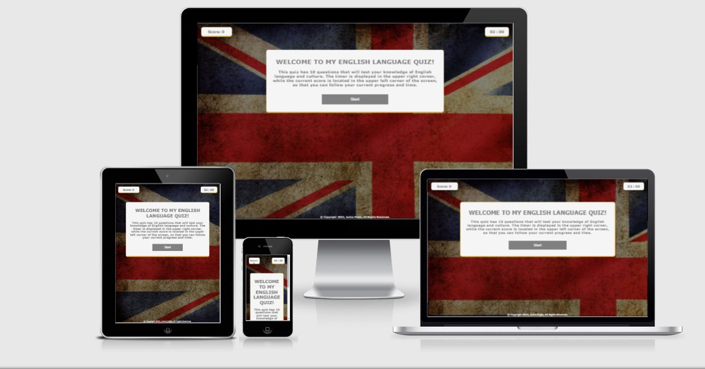
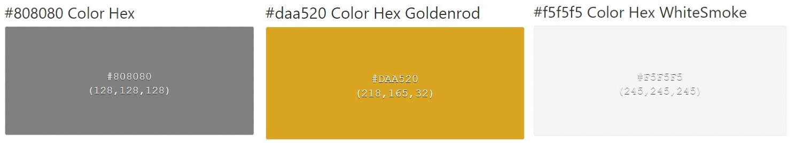
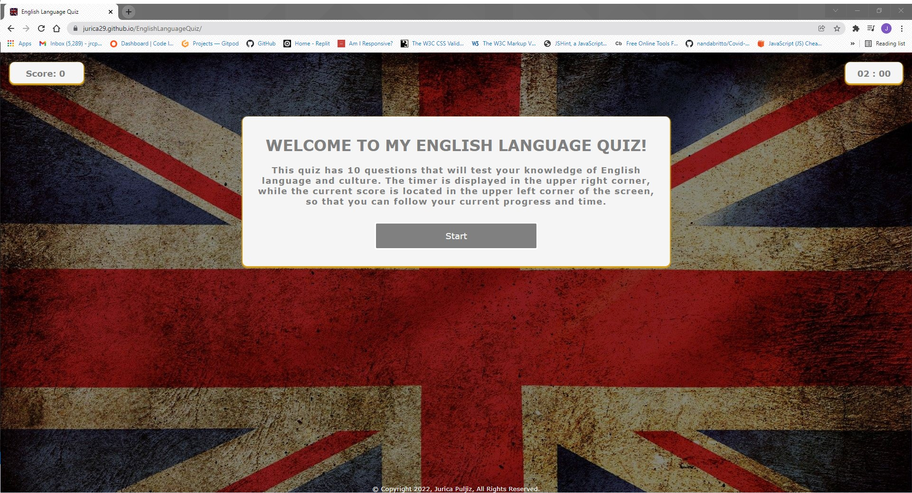
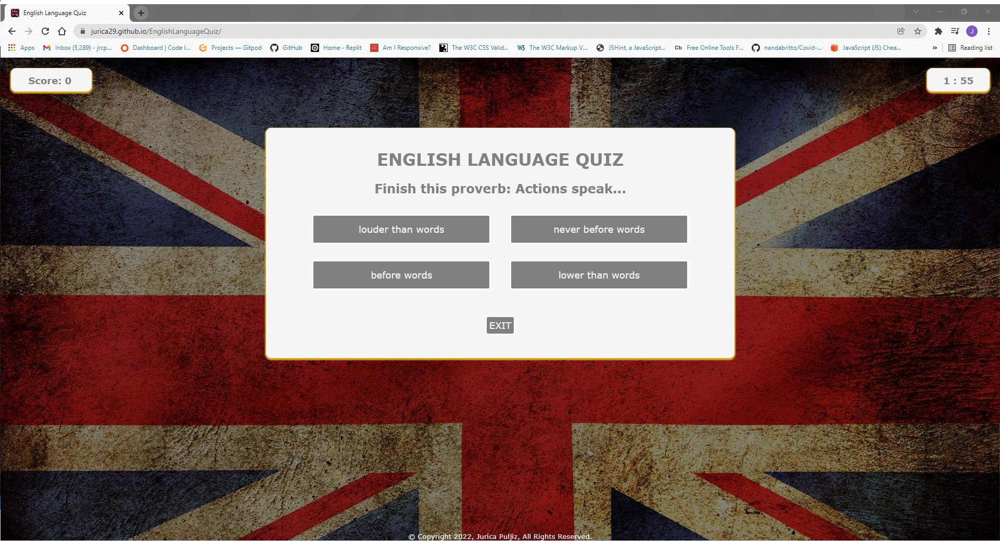
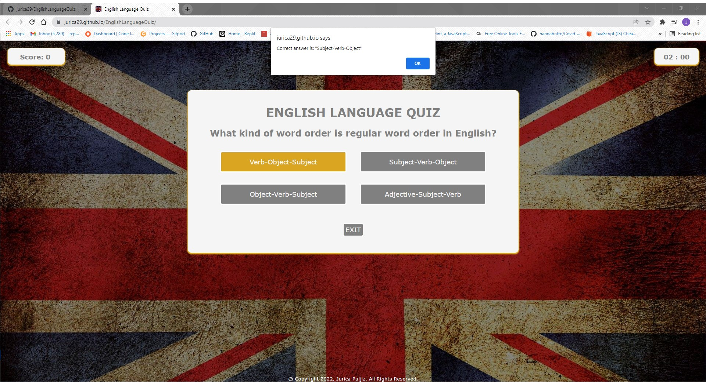
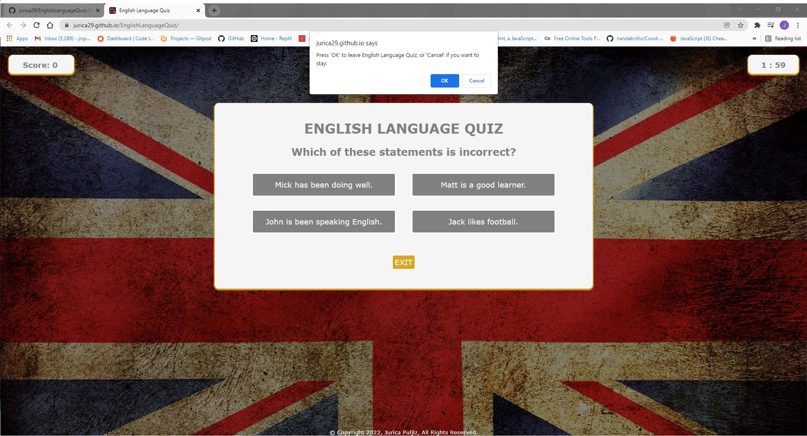
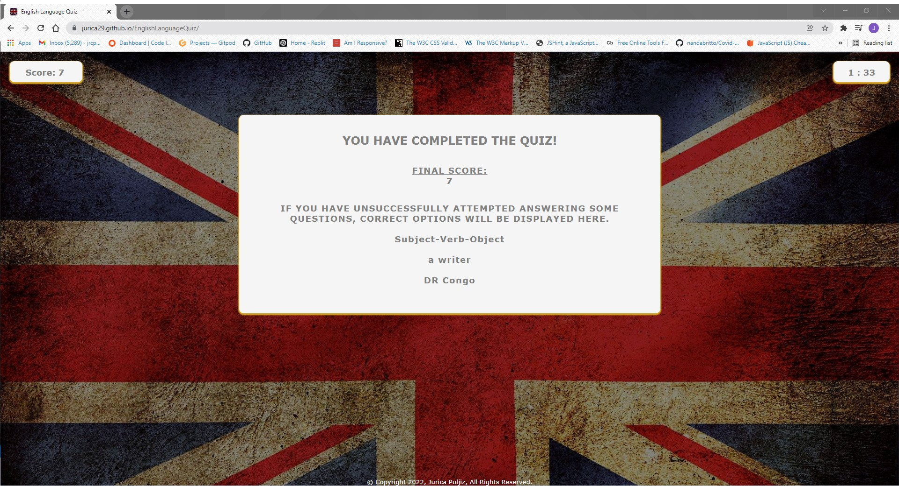
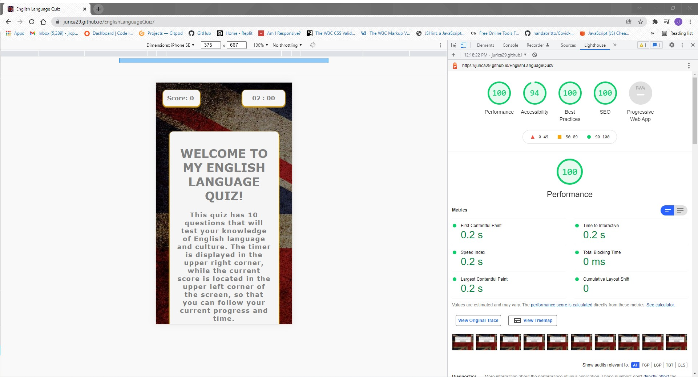

# English Language Quiz
This is a quiz that tests users' knowledge of English language and culture.



The deployed website can be viewed here. [English Language Quiz](https://jurica29.github.io/EnglishLanguageQuiz/).

## UX
### User Stories
+ As a user, I want to…
1.	be able to navigate through the quiz easily.
2.	see what is my current score all the time.
3.	see how much time I have left.
4.	see the feedback on my answers.
5.  get the final feedback on my performance and attempts at the end of the quiz.


### 1. Strategy 
* Project Purpose
  * Create an interactive quiz with consistent styling across all pages ensuring that the application runs flawlessly across all devices.

### 2. Scope
 * I wanted a simple, straightforward and intuitive UX experience.
 * Provide a fun and interactive application that tests users' English knowledge.
 * A site that is visually appealing on most devices.

### 3. Structure
*	A simple layout enables quick and easy navigation.
*	There are 3 basic parts of the quiz:
     * score counter in the upper left corner
     * time counter in the upper right corner
     * quiz card in the upper middle part of the page.

### 4. Skeleton
Wireframes created with Balsamiq. The project was developed from initial wireframes and very slight modifications were made during the development process to assure better usability. 

Click on the below page names to see these wireframes:

[Start page](https://github.com/jurica29/EnglishLanguageQuiz/blob/main/images/readmeimages/startpage.jpg)


[Quiz page](https://github.com/jurica29/EnglishLanguageQuiz/blob/main/images/readmeimages/quizpage.jpg)


[End page](https://github.com/jurica29/EnglishLanguageQuiz/blob/main/images/readmeimages/endpage.jpg)

### 5. Surface
* Colours

Main colours used are grey, whitesmoke and goldenrod. Grey is used for text and buttons, white for text and backgrounds of containers, while goldenrod is used for box shadowing and hovering for buttons.



* Font Selection
 
The font family used across the website for both headings and paragraphs is "Verdana, Geneva, Tahoma, sans-serif".

## Existing Features 

+ START PAGE

This is a start page displaying the introducing message and instructions. Also, it enables user to start game when ready.



All the other pages are connected to this one and javascript enables interactive display of each of them as the user moves through the app.

+ QUIZ PAGE

This page is displaying question and answers, while also enabling user to quit game whenever they want via the "exit" button.
There is a score counter in the upper left corner, while the timer is located in the upper right corner.



* Interactive message displays when user clicks on the incorrect answer and displays the correct answer to the user, which is also followed by color change of the incorrect option (red).



* Interactive message displays when user wants to exit the game, giving user two possibilities.



+ END PAGE

This page is displaying a final score and a message according to the outcome of the quiz, while also enabling user to see the correct
answers for all of his attempted answers.



+ FOOTER

The footer section is very simple and just includes the copyright text.


# Testing

## Automated tests
  + LIGHTHOUSE TEST

  The website has been test via Lighthouse from Dev tools.

 

  + HTML

  The whole HTML code has been tested in the W3C Markup Validator no errors have been found [W3C validator](https://validator.w3.org/).
  Code Validation results:
  
  [Results](https://github.com/jurica29/EnglishLanguageQuiz/blob/main/images/readmeimages/html.jpg)     
    
   + CSS

No errors were found when passing through the official [W3C validator](https://jigsaw.w3.org/css-validator/). 

CSS validation results can be viewed [here](https://github.com/jurica29/EnglishLanguageQuiz/blob/main/images/readmeimages/css%20.jpg)
    <a href="http://jigsaw.w3.org/css-validator/check/referer">
        
    </a>
No warnings were found.

+ JAVASCRIPT 

The whole JS code has been tested in the JS Hint [JS Hint](https://jshint.com/).

  Code Validation results:
  
  [Results](https://github.com/jurica29/EnglishLanguageQuiz/blob/main/images/readmeimages/jshint.jpg)  

As it can be seen here, there are 3 variables that JS Hint considers to be unused. However, these are efficiently working in the existing code, thus not hindering any functionality or interactiveness.

## Manual Testing

   + Desktop

 Mozilla Firefox, Google Chrome, Microsoft Edge: everything is working good. Page loads and all of the page features are working.

   + Mobile
 
 Tested with Huawei P30, Samsung A52, Huawei P40 and iPhone 12. It is responsive as intended.

   + Mozilla Dev Tools
 
 Tested for available devices, webpage works well. It is responsive as intended.

 [Screenshot from a mobile phone device](https://github.com/jurica29/EnglishLanguageQuiz/blob/main/images/readmeimages/smallerdevices.jpg)

## Future Features

I would like to add further graphical improvements and possibly sounds, videos or images that would be used throughout the quiz for the purpose
of language learning. Also, the timer could be having some sounds that would improve the whole game experience.

## Project Bugs and Solutions:

 Tested but not found in my tests.

## Deployment

 The website was deployed to GitHub pages. 
 
 * The steps to deploy are as follows: 
  - In the GitHub repository, navigate to the Settings tab; 
  - From the source section drop-down menu, select the Master Branch;
  - Once the master branch has been selected, the page will be automatically refreshed with a detailed ribbon display to indicate the successful deployment. 
The live link can be found [here](https://github.com/jurica29/EnglishLanguageQuiz).

### Forking the GitHub Repository:

By forking the GitHub Repository you will be able to make a copy of the original repository on your own GitHub account allowing you to view and/or make changes without affecting the original repository by using the following steps:
1. Log in to GitHub and locate the [GitHub Repository](https://github.com/jurica29/EnglishLanguageQuiz)
2. At the top of the Repository (not top of page) just above the "Settings" Button on the menu, locate the "Fork" Button.
3. You should now have a copy of the original repository in your GitHub account.

### Making a Local Clone

1. Log in to GitHub and locate the [GitHub Repository](https://github.com/jurica29/EnglishLanguageQuiz)
2. Under the repository name, click "Clone or download".
3. To clone the repository using HTTPS, under "Clone with HTTPS", copy the link.
4. Open Git Bash
5. Change the current working directory to the location where you want the cloned directory to be made.
6. Type `git clone`, and then paste the URL you copied in Step 3.
```
$ git clone https://github.com/YOUR-USERNAME/YOUR-REPOSITORY
```
7. Press Enter. Your local clone will be created.

## Credits 

### Content

I am author of the content that is used in questions and answers.

### Media

- Image used in this project is from [depositphotos](https://depositphotos.com/).
Picture was treated (resized) with IrfanView app.

### Work based in other code

+ [Favicon generator](https://www.favicon-generator.org/) – Used to create favicon used on website.
+ [W3 Schools](https://www.w3schools.com/) - Used for variety of tutorials and deeper understanding of some important concepts related to both HTML and CSS.
+ [Web Cifar Youtube channel](https://www.youtube.com/channel/UCdxaLo9ALJgXgOUDURRPGiQ) - Used for possible quiz ideas.
+ [James Q Quick Youtube tutorial](https://www.youtube.com/watch?v=u98ROZjBWy8&list=PLDlWc9AfQBfZIkdVaOQXi1tizJeNJipEx&ab_channel=JamesQQuick) - Used for the outline ideas.


### Acknowledgements

-	To the Code Institute course material, as the basis of all my knowledge comes from there.
-	To the Slack community as I have used the different channels to find answers to problems!
-  Stack Overflow as a valuable resource for solving a couple of issues.
- To [Freecodecamp](https://www.freecodecamp.org/) for its' dedicated JS tutorial.
-  [W3schools](https://www.w3schools.com/) and [Stack Overflow](https://stackoverflow.com/) for general reference and some tips.

I would also like to thank to:

-	My mentor Rahul, for his time, support and guidance throughout our video calls.
-	My fiancée Maja, for all support and patience during the project development.
